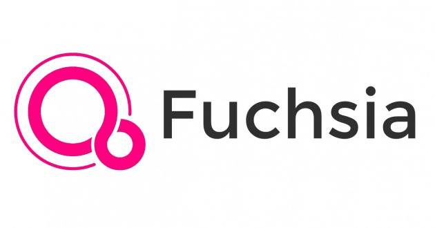

%Exploratory Project on **Google Fuchsia**
%EURECOM, Semester Project 2018-2019

---
 numbersections: true
 bibliography: ref.bibtex
 fontsize: 12pt
---

\vspace{1cm}

\vspace{2.5cm}
**Supervisors** **\hfill Students** \newline
Davide Balzarotti \hfill Andrea Palmieri \newline
Yanick Fratantonio \hfill Paolo Prem \newline
Dario Nisi \newline
Fabio Pagani \newline
Andrea Possemato \newline

\tableofcontents

\newpage

# Introduction

Fuchsia is a new operating system currently being developed by Google. 
The project appeared on GitHub in August 2016 and it is currently hosted at *fuchsia.googlesource.com*[@source]. Although the development of the project has been under way for more than two years, Google has not officially announced it yet. While the other operating systems developed by Google - Chrome OS and Android - are based on the Linux kernel, Fuchsia is based on a new *micro-kernel*, called **Zircon**. 

The description of the project suggests that Fuchsia will be able to run on different platforms: from embedded systems to smartphones, tablets and even personal computers. In May 2017 a user interface was added to the main project, which contributed to media speculation about Google's intentions with Fuchsia, including the possibility that it could replace Android in the future.

In the official documentation, Fuchsia is defined as a *“modular, capability-based operating system"*[@doc]. The **modular** term of the definition refers to the fact that the components of the system are divided into distinct process, as opposed to the traditional monolithic operating systems. This approach introduces different advantages, such as an easier update mechanism and features addition, as well as the possibility to download parts of components only when needed. The second part of the definition, instead, refers to the **capability-based security** enforced in Fuchsia by the use of constructs called *handles*.

In this report we are going to discuss the results of our exploratory semester project. It has to be considered that the operating system is still under development; thus the topics examined on this report and in project itself are continually subject to changes. In order to be updated with the development of Fuchsia, we recommend to follow the official documentation available on *fuchsia.googlesource.com*[@doc]. 

# Fuchsia Layers

In the Google documentation, it is often used the analogy of a 4 layer cake to describe the organization of the Fuchsia project; the names of the layers are: **Zircon**, **Garnet**, **Peridot** and **Topaz**. In this section we are going to briefly describe their purpose and main features. 

{#id .class width=45% }

## Zircon

Zircon[@zircon] is the lowest level of the cake and includes the part of the project we worked with most directly. It contains the micro-kernel behind Fuchsia, also called Zircon, together with a small set of userspace services, drivers, and libraries (like *libc* and *fdio*). Zircon also defines the **Fuchsia Interface Definition Language** (FIDL), which is the protocol used to create bindings between different languages, such as Dart, Go, C/C++ and Rust. The main role of this layer is to ensure the boot of the system, handle the interaction with the hardware, load and run userspace processes.

## Garnet

The layer built on top of Zircon is called Garnet[@garnet]. It contains *“device-level system services for software installation, administration, communication with remote systems, and product deployment”*.
Some of the modules included in Garnet are: the network service
(*Escher*[@escher]), the graphics renderer (*Amber*), the package management and update system. The idea behind this layer is to be able to update all the components running on the Fuchsia system, including apps and the Zircon kernel. 

## Peridot

The main role of Peridot[@peridot] is to handle the modular approach of Fuchsia. In the documentation it is written: "*almost everything that exists on a Fuchsia system is stored in a Fuchsia* **package**." This includes software and system files, which, instead of being all-in-one programs, are made up of **components**. 

{#id .class width=45% }

These components are small piece of software designed to perform specific jobs; currently, there are 2 kinds of components available: **agents** and **modules**. An agent is a component working in the background, which provides information to other components. The modules, instead, are the components working on the foreground and tagged with a specific **task**. 
When looking at the roles of agents and modules, it is easy to draw a parallel with services and activities in Android, which are working, respectively, in the background and foreground. However the modular approach of Fuchsia goes even further; indeed every module includes a list of action it can perform (**verbs**) and the entities it can interact with (**nouns**). In this way, if the user wants to perform a specific action, Fuchsia will find the best tool for that action by converting it into a noun and a verb; then it will look through the modules matching the verb and filter the list on the ones that can handle the specified noun.

The Peridot layer contains Ledger, which manages and provides the data storage to each component. These data are separated from one another at component and user level: “*the data store for the particular component/user combination is private – not accessible to other apps of the same user, and not accessible to other users of the same app*”[@ledger]. All the data stores together creates the *personal ledger* of the user, which is synchronized across different devices through the cloud. In this way, users could select an action to take on a device, while actually performing it on another device and having a distributed storage system.

## Topaz

Topaz[@topaz] is the top layer of the cake and it currently contains four major categories of software: modules, agents, shells and runners.
Modules are similar to Android apps: some examples are calendar and email. Shells include the base shell and the user shell, while agents - as previously mentioned - are working in background and can be seen as Android's services. The runners Fuchsia is going to include are the Web, Dart, and Flutter runners.
The role of the Flutter runner is particularly important for Fuchsia, since it would allow developers "*to build beautiful native apps on iOS and Android from a single codebase*"[@flutter]. 

# The Zircon Kernel

Fuchsia's micro-kernel has the same name of the layer in which it is placed: Zircon. The micro-kernel *“provides syscalls to manage processes, threads, virtual memory, inter-process communication, waiting on object state changes and locking”*[@zirconk]. 

Zircon was originally a branch of **LK** (LittleKernel[@lk]), another kernel developed at Google for small systems, typically used in embedded applications. However Zircon targets devices have less resource constraints, thus some concepts were added on top of LK, such as the concept of process. Other main differences are that Zircon is 64-bit only, while LK is 32-bit and that Zircon has a capability-based security model, while in LK all code is trusted.

## Zircon Kernel objects

Zircon is a *object-based kernel* where user mode code almost exclusively interacts with OS resources via object handles. Kernel objects do not have a notion of security and do not perform authorization checks: thus security rights are held by handles.
A handle is a sort of an active session with a specific OS subsystem scoped to a particular resource. Zircon Kernel objects are divided into 6 categories. For the purpose of this report we are going to briefly analyze only 3 of them, however the documentation covers all of them in the *Zircon Kernel objects* page[@zko].

### IPC

One of the object categories is dedicated to Inter-Process Communication, and it contains 3 types of kernel objects: channels, sockets and FIFOs. The first two objects are both means for bi-directional inter process communication, but the former can transport data and handles, while the latter can move only data. FIFOs are the classic first-in first-out interprocess queue, and their read and write operations are more efficient than sockets or channels, but there are some restrictions on the size of elements and buffers.

### Tasks

This object category includes the *runnable* kernel objects: jobs, processes and threads. They all share the ability to be suspended, resumed and killed.

{#id .class width=65%}

A Zircon job is a set of processes and child jobs. They are used to track privileges to call syscalls and perform other kernel operations, as well as track and limit the resource consumption. Every process belongs to a single job and every job (except the root one) belongs to a single parent job.

A Zircon process is defined as *"a set of instructions which will be executed by one or more threads, along with a collection of resources"*. Processes are owned by jobs and they contains handles, Virtual Memory Address Regions and threads. A process is created via `zx_process_create()` and its execution begins with `zx_process_start()`. The process stops the execution when:

- the last thread is terminated or exits
- the process calls `zx_process_exit()`
- the parent job terminates the process or is destroyed

A thread is defined as a *"runnable computation entity"* and it is the kernel object representing a time-shared CPU execution context. Threads are associated to a process object, which provides the memory and the handles to other objects necessary for computation. A thread object is created using `zx_threar_create()`, but the execution starts when `zx_thread_start()` is called. It is possible to terminate a thread in these ways:

- by calling `zx_thread_exit()`
- when the parent process terminates
- by calling `zx_task_kill()` with the thread's handle

### Memory and address space

This object category includes Virtual Memory Objects (VMO) and Virtual Memory Access Regions (VMAR).

A Virtual Memory Object represents a contiguous region of virtual memory that may be mapped into multiple address spaces. They are used in by the kernel and userspace to represent paged and physical memory as well as for sharing memory between processes and between the kernel and userspace. VMOs are created with `zx_vmo_create()` and basic I/O can be performed on them using `zx_vmo_read()` and `zx_vmo_write()`. The size of a VMO can be explicitly defined and will be rounded up to the next page size boundary by the kernel.

Virtual Memory Address Regions represent the allocation of an address space and they are used to map VMOs. Every process starts with a single VMAR that spans the entire address space. Each VMAR can be logically divided into any number of non-overlapping parts, each representing a child VMAR, a virtual memory mapping, or a gap. Moreover, VMARs have a hierarchical permission model for allowable mapping permissions: for example, if the root VMAR allows read, write, and executable mapping, it is possible to create a child VMAR that only allows read and write mappings. By default, all allocations of address space are randomized. 

## Handles

Handles are used to refer to kernel objects from the userspace and they can be transmitted to other processes over channels, by using either `zx_channel_write()` or `zx_process_start()` and passing the handle as the argument of the first thread into a new process. Every object may have multiple handles that refers on them, even in the same process. Typically, when the last open handle referring to a specific object is closed, the object is destroyed or put into a final and permanent state. In addition to pointing to kernel object, a handle specifies also the actions which may be performed on the object; two handles that refer to the same object may have different rights.

`zx_handle_duplicate()` and `zx_handle_replace()` may be used to obtain additional handles referring to the same object as the Handle passed in, optionally with less rights. The `zx_handle_close()` system call, instead, closes a given handle. In case that handle is the last one pointing to that object, the object is released.

## vDSO

vDSO stands for **virtual Dynamic Shared Object** and it represents the only means of access to system calls in Zircon. It is a *dynamic shared object* because it is a shared library in the ELF format, however it is virtual because it’s not loaded from an ELF file that is located in a filesystem. Instead, the vDSO image is provided directly by the kernel at compile time, which exposes it to userspace as a *read-only Virtual Memory Object*.

Whenever a program loader sets up a process, the only way to make system calls is for the program loader to map the vDSO into the new process's address space before its first thread starts running. Therefore, each process that will launch other processes capable of making system calls must have access to the vDSO VMO.

### vDSO Structure

The vDSO structure consists of consecutive segments, each containing aligned pages:

- The first segment is read-only, and includes the ELF headers and metadata for dynamic linking along with constant data private to the implementation of the vDSO.
- The second segment is executable, and it contains the vDSO code.

### vDSO Enforcement

As mentioned above, the vDSO entry points are the only means to enter the kernel to use system calls. Indeed the machine-specific instructions used to enter the kernel (such as syscall on x86) are not part of the system ABI, so it is invalid for user-code to directly execute such instructions. The interface linking the kernel to the vDSO code is *"a private implementation detail"*. Considering that the vDSO is itself normal code that is executed in userspace, the kernel is responsible to handle all the possible entries into the kernel mode from the userspace. Nevertheless, some potential kernel bugs can be partially mitigated by enforcing that every kernel entry hast to be made from the proper vDSO code.

Correct use of the vDSO is enforced by the kernel in two ways; the first one being about how the vDSO can be mapped into a process. Indeed, when `vmar_map()` is called using the vDSO and requesting `ZX_VM_PERM_EXECUTE`, the kernel requires that the offset and size of the mapping match exactly the vDSO‘s executable segment. Moreover, only one of such mapping is allowed and, once the valid vDSO mapping has been established in a process, it cannot be removed. Trying to map the vDSO a second time into the same process, to unmap the vDSO code, or even make an executable mapping that does not include the correct offset and size, will return `ZX_ERR_ACCESS_DENIED`. At compile time, the offset and size of the vDSO‘s code segment are obtained directly from the vDSO ELF file and used as constants to check the correct mapping of the kernel. When a process establish a valid mapping of the vDSO, the kernel stores the address of such process, so it can be retrieved quickly.

The second method to enforce the correct use of the vDSO consists in constraining what PC locations can be used to access the kernel.
When a user thread enters the kernel for a syscall, a register indicates which of the private interface between the kernel and the vDSO is being invoked. Many of these interfaces, often called *low-level syscall*, correspond directly to the system calls in the public ABI, but others do not. Given a low-level system call, only a fixed set of PC locations in the vDSO code can invoke that call. The source code for the vDSO defines internal symbols identifying each such location. At compile time, these locations are extracted from the symbol table and used to generate the kernel code that defines a PC validity predicate for each low-level system call. Considering that the vDSO used by all user process is defined only once, these predicates check for valid, known offsets from the beginning of the vDSO code segment.
While entering to the kernel for a system call, the PC location of the syscall instruction are examined on on x86 - or on other machines' instruction. The base address of the vDSO code used to call `vmar_map()` is subtracted from the PC, and the resulting offset is passed to the validity predicated for the specific system call which is being invoked. In case the predicate says the PC value is invalid, the calling thread will not be allowed to proceed with the system call.

### vDSO Variants

vDSO variants are an experimental feature that was proposed in the Fuchsia documentation. Currently only a proof-of-concept implementation and some simple tests are available, but the general approach would include to provide variants of the vDSO image which export only a subset of the full vDSO syscall interface. In this way, system calls that would be used by device drivers might not be included in the vDSO variant used for normal application code.

## Syscalls

As mentioned above, system calls are provided by `libzircon.so`, which is a **virtual shared library** that the Zircon kernel provides to userspace, better known as the virtual Dynamic Shared Object or vDSO. The system calls are C functions of the form `zx_noun_verb()` or `zx_noun_verb_direct-object()`.
The expected number of system call that Zircon will include is approximately 100, however some temporary syscalls are currently available, mostly for debug purposes; these temporary syscalls will be removed once *"API/ABI surface is finalized"*. Zircon syscalls are generally non-blocking, some exceptions are `wait_one`, `wait_many`, `port_wait` and `thread_sleep`.

System calls are used to make userspace code interact with kernel objects, almost exclusively using **handles**. In the userspace, a handle is a 32bit integer (type `zx_handle_t`). Before executing a , Zircon checks that the specified handle parameters refer to an handle that exists in the handle table of the calling process. Moreover, the kernel checks that the handle has the required rights for the requested operation. 

From an access standpoint, system calls fall into three categories:

- Calls having no limitations: there are only a very few, such as `zx_clock_get()` and `zx_nanosleep()`; these may be called by any thread.
- Calls which take a handle as the first parameter: the specified handle denotes the object the syscall acts upon. This category includes most of the system call.
- Calls which create new objects without taking a handle: access and limitations of these calls is controlled by the job in which the calling process is contained. Two examples of these category of syscalls are `zx_event_create()` and `zx_channel_create()`. 

The system calls are defined by `syscalls.abigen` and processed by the `abigen` tool. The complete list of system call is available on *fuchsia.googlesource.com*[@syscalls].

# Filesystem 

Fuchsia’s filesystems live entirely within userspace as simple processes which implement servers. In this way Fuchsia’s filesystems themselves can be changed easily and their modifications don’t require recompiling the kernel. The primary mode of interaction with a filesystem server is achieved using the handle primitive rather than system calls. The kernel has no knowledge about files, directories, or filesystems, so filesystem clients cannot ask the kernel for filesystem access directly.

## Open life cycle

The `open` call is a function provided by a standard library; for C/C++ programs, this will normally be declared in `unistd.h`. While on a monolithic kernel an open would be a lightweight shim around a system call,the Zircon kernel intentionally has no such system call. Indeed clients access filesystems through channels.

When a process is initialized, it is provided a table of *“absolute path”* : *“handle”* mappings. All paths accessed from within a process are opened by directing requests through this namespace mapping. In case a relative path was used, the incoming call could be sent over the path representing the current working directory. The standard library is responsible for taking a handle and making them appear like file descriptors, so that the “file descriptor table” is a notion that exists within a client process. A library called *fdio* is responsible for providing a unified interface to a variety of resources, such as files, sockets, services, pipes, and more. This layer defines a group of functions, such as *read*, *write*, *open*, *close*, *seek*... that may be used on file descriptors. Each supported protocol is responsible for providing the required client-side code to interpret the specifics of their interaction. For example, sockets provide multiple handles to clients: one acting for data flow, and one acting as a control plane. Instead, files typically use only a single channel for control and data.

An “open” call go through the standard library, acting on the current working directory *fdio object*, which transformed the request into a FIDL message, which is sent to the server using the `zx_channel_write` system call. The client can optionally wait for the server’s response using `zx_object_wait_one`, or continue processing asynchronously. Either way, a channel has been created, where one end lives with the client, and the other end is transmitted to the server.

# Contribution

# Conclusions
In this report we discussed the results of exploratory semester project about Fuchsia. We started with a general description of the 4 levels the *Fuchsia cake*, and continued with an more specific analysis on the Zircon kernel. In particular, the third section is focused on kernel objects, handles, the vDSO and system calls. In the fourth section we reported a brief study of Fuchsia filesystems and an example of how an *open* call is handled.

In the last section we illustrated our contribution, which is summarized in ....

An important part of the semester project was dedicated to reading and understanding the Fuchsia documentation, which, to date, is still incomplete and with frequent changes. The absence of documentation and material has slowed down a good part of the objectives, but has also contributed positively to the originality of the project and has allowed us to enrich our knowledge with new and state-of-the-art topics.

# References
